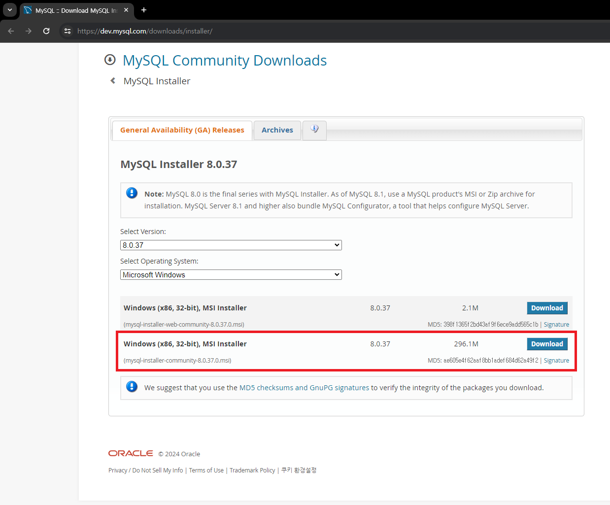
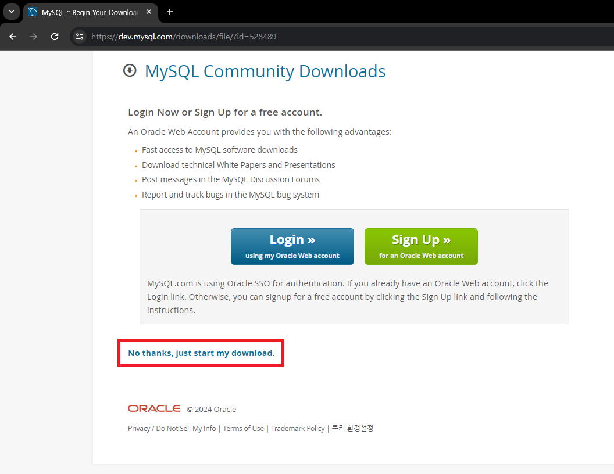
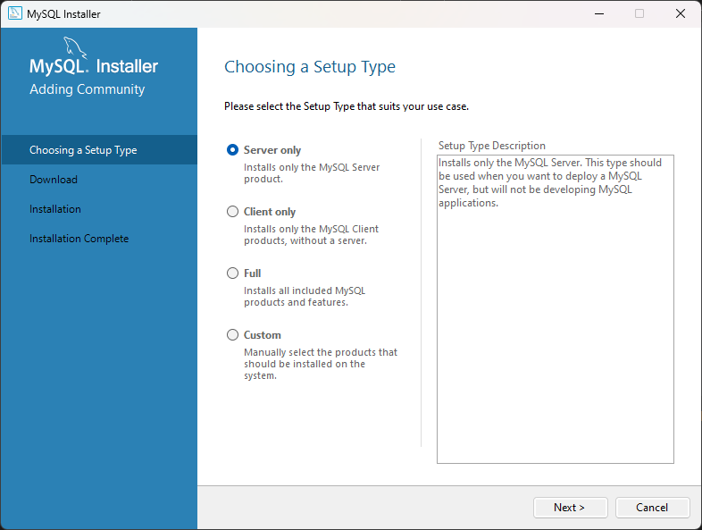
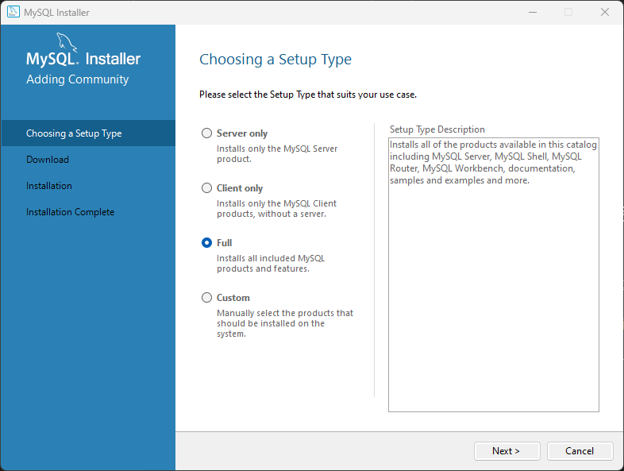
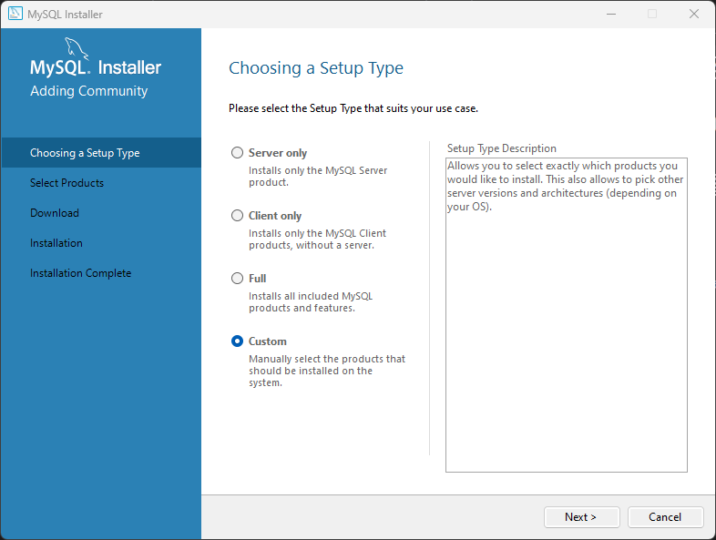

# MySQL 설치 방법

 

## 1. MySQL 홈페이지 접속
[MySQL 다운로드 링크 (https://dev.mysql.com/downloads/installer/)](https://dev.mysql.com/downloads/installer/)

 

## 2. MySQL Installer 다운로드
### 2024년 5월 13일 기준 최신 버전 : **8.0.37**

 

용량이 큰 걸로 다운로드 받는다.     

 

No thanks, just start my download.를 클릭해서 <u>**로그인 하지 않고 바로 다운로드**</u>

 

## 3. 다운로드 완료 후 MySQL Installer 실행

 

### 설치 타입

* **Server only** : Installs only the MySQL Server product. ( MySQL 서버만 설치 )

 

* **Client only** : Installs only the MySQL Client products, without a server. ( MySQL 애플리케이션 관리에 필요한 도구만 설치 )

 

* **Full** : Installs all included MySQL products and features. ( 모든 제품 설치 )

 

* **Custom** : Manually select the products that should be installed on the system. ( 사용자에게 필요한 제품만 설치할 수 있도록 선택 가능 )
