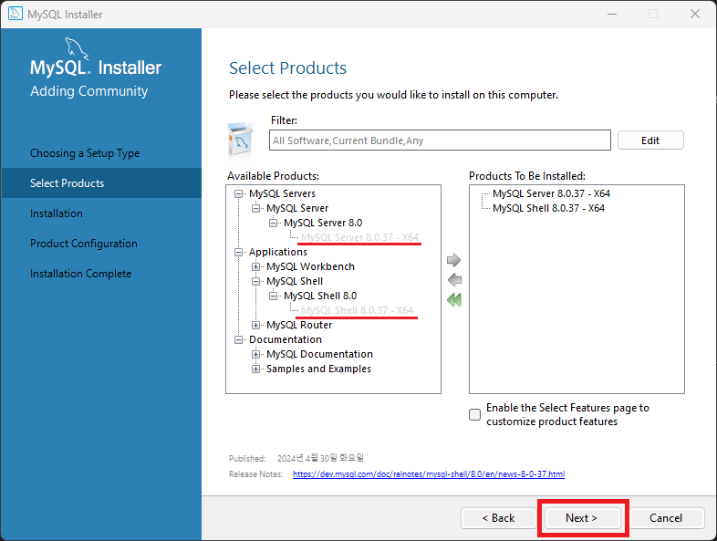

# MySQL 설치 방법

 

## 1. MySQL 홈페이지 접속
[MySQL 다운로드 링크 (https://dev.mysql.com/downloads/installer/)](https://dev.mysql.com/downloads/installer/)

 

## 2. MySQL Installer 다운로드
### 2024년 5월 13일 기준 최신 버전 : **8.0.37**

 

용량이 큰 걸로 다운로드 받는다.     

 

No thanks, just start my download.를 클릭해서 <u>**로그인 하지 않고 바로 다운로드**</u>

 

## 3. 다운로드 완료 후 MySQL Installer 실행
### Custom 클릭 후, 우측 하단 'Next >' 버튼 클릭

  
<h3>설치 타입 자세히 보기</h3>

  * **Server only** : Installs only the MySQL Server product. ( MySQL 서버만 설치 )
  

   

  * **Client only** : Installs only the MySQL Client products, without a server. ( MySQL 애플리케이션 관리에 필요한 도구만 설치 )
  

   

  * **Full** : Installs all included MySQL products and features. ( 모든 제품 설치 )
  

   

  * **Custom** : Manually select the products that should be installed on the system. ( 사용자에게 필요한 제품만 설치할 수 있도록 선택 가능 )
  

 

### 다음 이미지와 같이 커스텀 후, 우측 하단 'Next >' 버튼 클릭

  
<h3>사용 가능 제품 자세히 보기</h3>

  * MySQL Servers
    * MySQL Server : 데이터 베이스 서버 자체를 의미하면, 가장 핵심 시스템

   

  * Applications
    * MySQL Workbench : MySQL 데이터베이스를 시각적으로 관리하기 위한 GUI 도구
    * MySQL Shell : CMD에서 MySQL과 상호 작용하기 위한 공식 인터페이스로 데이터베이스 관리 및 쿼리 실행을 지원
    * MySQL Router : 클라이언트 앱과 MySQL 서버 간의 연결 관리를 담당하는 중간 계층 라우팅 솔루션으로 로드 밸런싱, 장애 조치 및 보안을 포함한 다양한 기능 제공 

   

  * Documentation
    * MySQL Documentation : MySQL 공식 문서 다운로드
    * Samples and Examples : MySQL 샘플 코드와 예제 코드 다운로드

